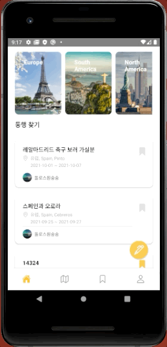
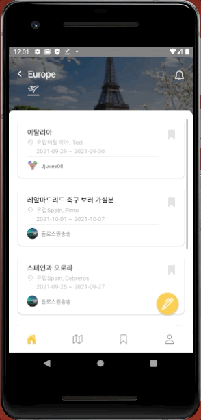
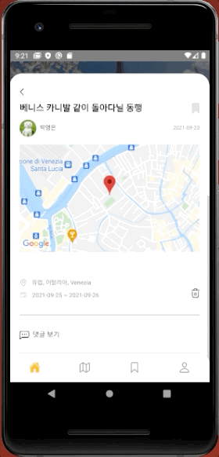
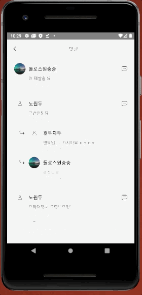
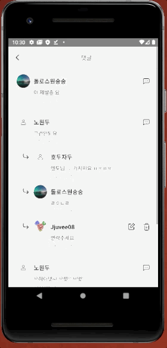
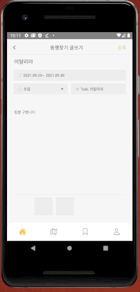
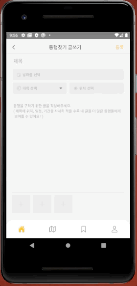
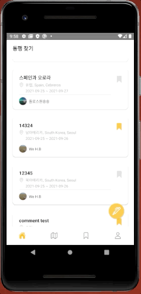
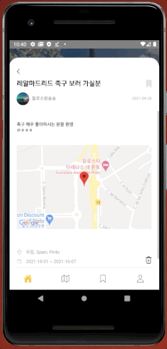

제발 좀 읽어주세요

# 헤이고 (HeyGo)

## Intro

- 팀명 : 원두없는 원두팀
- 프로젝트 명 : 헤이고
- 프로젝트 형태 : 수강생 프로젝트

## 프로젝트 소개

해외 여행을 할 때 단기간으로 동행을 구해야 할 때가 종종 있다.

이 프로젝트에서는 사용자가 각 여행지, 나라에서 필요한 기간, 위치를 기반으로 동행을 구하는 글을 등록하고 사용자들에게 게시글들을 여행지 전체, 또는 원하는 여행지 안에서, 분류하여 보여준다.

사용자는 자신이 함께하길 원하는 동행 글을 스크랩할 수 있다.

또한 게시글에 댓글을 등록하여 해당 게시글의 글쓴이와 대화를 통해 동행여부와 일정, 장소 등에 대해 이야기 나눌 수 있다.

## 사용스택

### 프론트엔드

- Typescript
- Javascript
- React Native
- Emotion Native
- Apollo Client
- React Navigation
- GraphQL
- Firebase

### 백엔드

- GraphQL
- Firebase

## 주요 페이지

### Splash Screen Page

- 맨처음 나오는 페이지

  

### Login Page

- Firebase 를 이용한 구글 소셜 로그인 API 적용

  

### Main Page

- 전체 글 목록
- Area Page 목록

  

### Area Page

- 각 대륙별 글 목록

  
  

### BoardDetail Page

- 게시물 보기

  

### BoardComment Page

- 각 게시물 댓글 작성 ,목록 (글을 입력시 인풋 창 색 변화)
- 게시물 수정, 삭제

  
  
  

### BoardWrite Page

- 게시물 작성( 날짜 선택, 게시판 선택, 위치 선택, 사진 첨부)
- 입력칸이 빈칸일 경우 모달 경고창

  
  
  

### Scrap Page

- 게시물 스크랩 버튼, 스크랩 목록

  

### Map Page

- 지도 기능 및 각 지역에 게시물 불러오기

  

### My Page

- 마이페이지 (프로필 사진 설정 ,자기 소개란 작성, 여행 위치 작성 )
- 로그아웃 기능
- 내가 작성한 글 목록 보기

  
  
  

### User Page

- 선택한 유저의 게시글 모아 보기 기능

  
